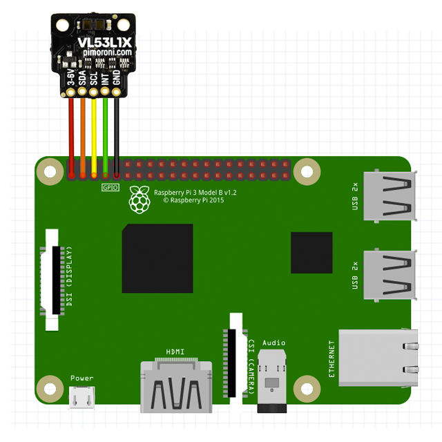

# SensorVL53L1X OpenFL Extension for Raspberry Pi 
### Reading data from a VL53L1x Distance Sensor connected via i2c

This extension is a wrapper for code taken from:  
https://www.waveshare.com/wiki/VL53L1X_Distance_Sensor


build with:
lime rebuild . rpi -clean

# installation
checkout and add:  
`haxelib dev SensorVL53L1X path_to_SensorVL53L1X`

add to project.xml  
`<haxelib name="SensorVL53L1X" />`

# example usage
```
    import sensors.SensorVL53L1X;
    import sensors.vl53l1x.events.DistanceEvent;

    ----
    var sensor = new SensorVL53L1X();
    if( sensor.initialize() ){
        sensor.addEventListener ( DistanceEvent.DISTANCE,  sensor_distance);
        sensor.startMeasuring();
    }

    private function sensor_distance (event:DistanceEvent):Void{
        trace('distance ${event.distance}');
    }

```

